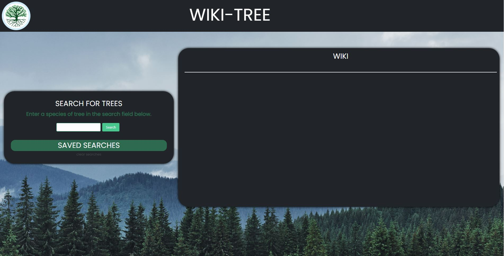
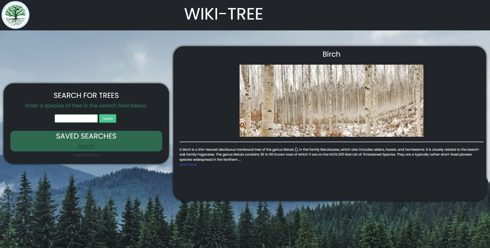

# Wiki-Tree

# Description

Wiki-Tree is an application that allows users to search for a specific tree and be presented with an image and a brief paragraph describing information regarding the tree.

 The application is easy to use and mobile friendly with locally saved information stored within the "saved searches" box. Users are able to go back to a previous searched tree with this feature as well as delete previous searches.

# User Story

* As a botanist studying trees I want to find information on specific species of trees so that I can further develop my research on these species of trees.

# Technologies Used

* HTML

* CSS

* JavaScript

* Bulma [CSS-Framework]

* Wikipedia API [Text-API]

* Pexel API [Image-API]

# Screenshots

# Links

[Deployed-Application](https://hunterbrennan1.github.io/TODO-Team-Name-repo/)

[Repo-Link](https://github.com/HunterBrennan1/TODO-Team-Name-repo)
